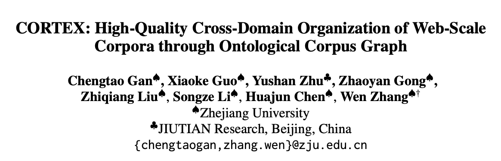
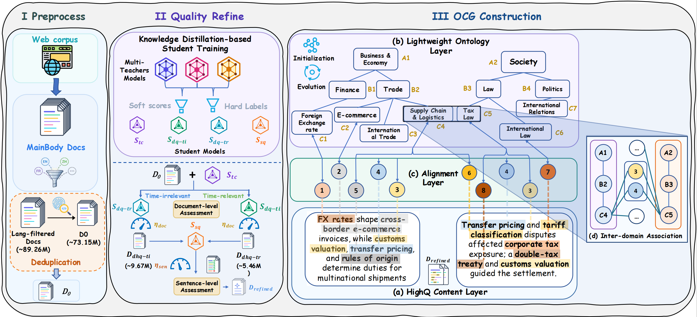
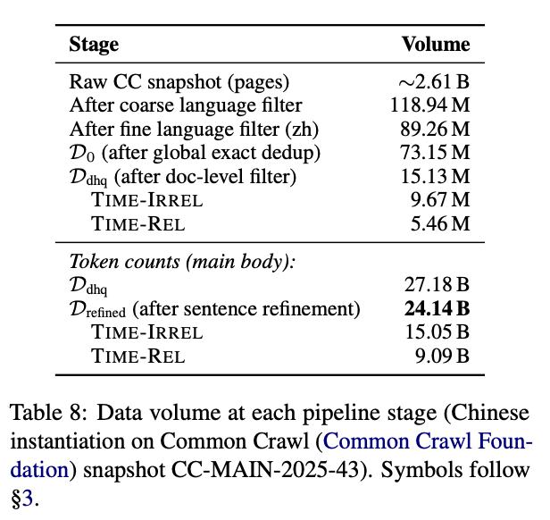
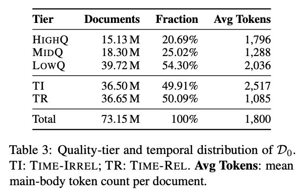
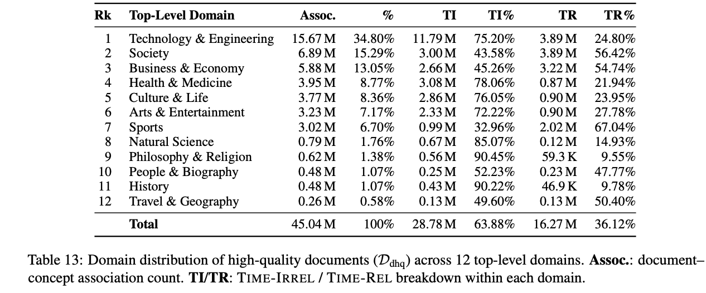
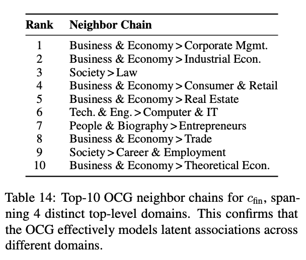

# CORTEX: High-Quality Cross-Domain Organization of Web-Scale Corpora through Ontological Corpus Graph

[English](./README.md) | **简体中文**

<p align="center">
  
</p>

<p align="center">
  <a href="https://arxiv.org/abs/2606.30175"></a>
  <a href="https://arxiv.org/abs/2606.30175"></a>
  <a href="https://huggingface.co/datasets/zjukg/CORTEX"></a>
</p>

## 摘要

大语言模型的持续演进不断提高对数据规模和质量的要求，而不同训练阶段提出日益定制化的数据需求，因此对高质量语料进行系统化组织变得不可或缺。现有语料构建流程将得到的语料限制在扁平、无差别的文档集合中，普遍缺乏系统性的知识组织。我们提出 CORTEX，据我们所知，这是首个通过本体语料图（Ontological Corpus Graph，OCG）将 Web 规模语料构建从扁平文档过滤提升为结构化知识组织的框架。OCG 是一个三层异构结构，统一了高质量内容层、通过大语言模型驱动的自动演化构建的层次化轻量本体层，以及支持任意分类层级跨领域关联的跨领域对齐层。综合实验验证了 CORTEX 的有效性。特别是，我们利用 OCG 合成了 CORTEXBench——一个跨领域搜索与推理基准；在八个前沿大语言模型上的评测验证了质量精炼、领域组织和跨领域数据合成的有效性。我们将公开完整代码库、带有 OCG 的 24.14B-token 精炼语料和 CORTEXBench。

## CORTEX 框架

<p align="center">
  
</p>

## 数据集结构

```text
.
├── CORTEXBench/
│   ├── CORTEXBench_QA.jsonl
│   └── candidate_pool/
│       └── *.jsonl                         # 917 个问题专属候选池
├── High_Quality_Content/
│   ├── README.md
│   ├── time_NOT_Related/
│   │   └── <本体层次结构>/
│   │       ├── <概念链>.jsonl              # 完整文档记录
│   │       └── Ranked_id/
│   │           └── <概念链>.jsonl          # 轻量索引记录
│   └── time_Related/
│       └── <本体层次结构>/
│           ├── <概念链>.jsonl              # 完整文档记录
│           └── Ranked_id/
│               └── <概念链>.jsonl          # 轻量索引记录
├── Hight_Quality_Content_to_Ontology/
│   ├── README.md
│   ├── Code/5_ConceptGraphConstruct/
│   │   ├── 1_ConceptGraphConstruct_TextGraph.py
│   │   ├── 2_ConceptGraphConstruct_Graph.py
│   │   └── 3_ConceptGraphConstruct_PrefixAssociation.py
│   ├── all/
│   │   ├── 01_raw_mountings.jsonl
│   │   ├── 02_chain_stats.json
│   │   ├── 03_keyword_stats.json
│   │   ├── 04_global_weights.jsonl
│   │   ├── 05_chain_profiles.json
│   │   ├── 06_neighborhood_associations.json
│   │   └── 07_summary_statistics.json
│   ├── time_NOT_Related/
│   └── time_Related/
└── Lightweight_Ontology/
    ├── README.md
    ├── Concept_Chain_Set.txt
    └── Concept_Chain_Set_Flatten.txt
```

## 文件夹大小

- `CORTEXBench`：37.72 GB，918 个文件
- `High_Quality_Content`：768.74 GB，1,613 个文件
- `Hight_Quality_Content_to_Ontology`：31.59 GB，25 个文件
- `Lightweight_Ontology`：22.8 KB，3 个文件
- **总计**：838.05 GB，2,559 个文件

## 数据集统计

### 各处理阶段的数据规模

<p align="center">
  
</p>

### 质量等级与时间属性分布

<p align="center">
  
</p>

### 高质量文档的领域分布

<p align="center">
  
</p>

### OCG 中的跨领域关联

<p align="center">
  
</p>

## 数据文件

### `CORTEXBench`

- `CORTEXBench_QA.jsonl` 包含 917 个问题及其参考答案、任务类别、源文档、黄金证据和候选池元数据。
- `candidate_pool/*.jsonl` 包含各问题对应的检索候选文档。每个候选池的设计规模约为 6,000 篇文档，实际数量记录在 `candidate_pool_records` 字段中。

### `High_Quality_Content`

精炼语料分为 `time_NOT_Related` 和 `time_Related`，两个子集均按照相同的 403 条叶级概念链组织。

- 完整文档文件包含文档元数据、正文、质量与时间相关性分数、句子级精炼结果、概念链关联和提取的关键词。
- `Ranked_id` 文件包含 `warc_id`、`target_confidence` 和 `ConceptChainsRelated_top_3`，用于轻量级排序和筛选。

### `Hight_Quality_Content_to_Ontology`

`all`、`time_NOT_Related` 和 `time_Related` 目录包含：

- 原始文档—概念链—关键词挂载记录；
- 各概念链和关键词的统计信息；
- 加权概念链—关键词边与概念链画像；
- 概念链间的邻域关联；
- 汇总统计。

随附代码用于构建文件形式的文本图、将其导入 Neo4j，以及查询概念链的邻域概念链。

### `Lightweight_Ontology`

- `Concept_Chain_Set.txt`：层次化轻量本体。
- `Concept_Chain_Set_Flatten.txt`：层次化轻量本体（展平版）。

## 下载与读取

本仓库包含多种文件模式，建议按所需组件或路径下载。

```bash
# 基准问答文件
hf download zjukg/CORTEX CORTEXBench/CORTEXBench_QA.jsonl \
  --repo-type dataset --local-dir ./CORTEX

# 轻量本体
hf download zjukg/CORTEX \
  --repo-type dataset \
  --include "Lightweight_Ontology/**" \
  --local-dir ./CORTEX

# 语料分支示例
hf download zjukg/CORTEX \
  --repo-type dataset \
  --include "High_Quality_Content/time_NOT_Related/自然科学/**" \
  --local-dir ./CORTEX
```

```python
import json

with open("CORTEX/CORTEXBench/CORTEXBench_QA.jsonl", encoding="utf-8") as f:
    for line in f:
        record = json.loads(line)
```

## 许可证

源数据通过 Common Crawl 获取，仍受 [Common Crawl 使用条款](https://commoncrawl.org/terms-of-use)及原始内容所有者相关权利的约束。

## 引用

```bibtex
@article{DBLP:journals/corr/abs-2606-30175,
  author       = {Chengtao Gan and
                  Xiaoke Guo and
                  Yushan Zhu and
                  Zhaoyan Gong and
                  Zhiqiang Liu and
                  Songze Li and
                  Huajun Chen and
                  Wen Zhang},
  title        = {{CORTEX:} High-Quality Cross-Domain Organization of Web-Scale Corpora
                  through Ontological Corpus Graph},
  journal      = {CoRR},
  volume       = {abs/2606.30175},
  year         = {2026},
  url          = {https://doi.org/10.48550/arXiv.2606.30175},
  doi          = {10.48550/ARXIV.2606.30175},
  eprinttype   = {arXiv},
  eprint       = {2606.30175},
  timestamp    = {Fri, 10 Jul 2026 14:26:04 +0200},
  biburl       = {https://dblp.org/rec/journals/corr/abs-2606-30175.bib},
  bibsource    = {dblp computer science bibliography, https://dblp.org}
}
```
